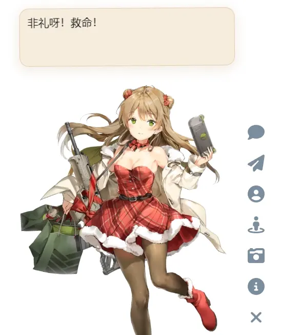
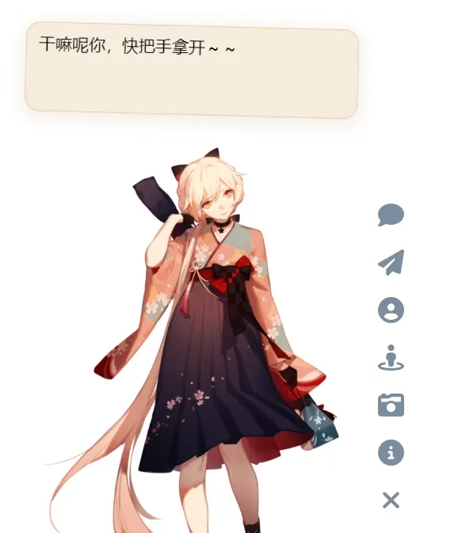

# WebLive2D-API

## 前言 To start with

- 本项目`Fork`自 [AdingApkgg/live2d-api](https://github.com/AdingApkgg/live2d-api)。
- 本项目 API 搭建方式参考自 [fghrsh/live2d_api](https://github.com/fghrsh/live2d_api)。
- 本项目代码参考自 [stevenjoezhang/live2d-widget](https://github.com/stevenjoezhang/live2d-widget)。
- 本项目模型来自 [Eikanya/Live2d-model](https://github.com/Eikanya/Live2d-model)，仅供学习交流，请勿用于商业用途，如有侵权，请联系删除。

## 特性 Feature

1. 将 Live2D API 完全 cdn 化，目录结构简单，便于编辑、添加和删除模型。
2. 为以 CDN 方式加载的 Live2D 模型，添加模型皮肤顺序切换的功能。
3. 将项目配置文件拆分成`<script>`与`<link>`标签的形式便于网站引入。

   

## 使用 How to use

你可以使用`CDN`节点的方式来为你的网站引入相关文件..

1. 使用`jsdelivr`引入。

   ```html
   <link
     rel="stylesheet"
     href="https://fastly.jsdelivr.net/gh/cxz206015/live2d-api@latest/waifu.css"
   />
   <script src="https://fastly.jsdelivr.net/gh/cxz206015/live2d-api@latest/js/autoload.js"></script>
   ```

2. 使用其他`CDN`节点引入。

   ```html
   <link
     rel="stylesheet"
     href="https://live2d-api.cxzde.cn/waifu.css"
   />
   <script src="https://live2d-api.cxzde.cn/js/autoload.js"></script>
   ```

> 你可以下载下来`js`和`css`文件来进行自定义配置，详细请参考 [live2d-widget 配置](https://github.com/stevenjoezhang/live2d-widget#%E9%85%8D%E7%BD%AE-configuration)。

## 作者成果 - AdingApkgg

1. 修正了少女前线(Girls Frontline)等 live2d 模型的文件路径错误以及文件名称错误，对模型的展示视口进行了相关的适配并修复了切换模型报错的问题。
   > PS:这环节究极折磨，打死不做第二遍。
2. 修正了部分模型语音与互动动作配置错误。
3. 将左右的`css`文件分别配置，添加顺序切换模型材质的`js`文件，并将随机切换与顺序切换的`js`文件分别配置。
